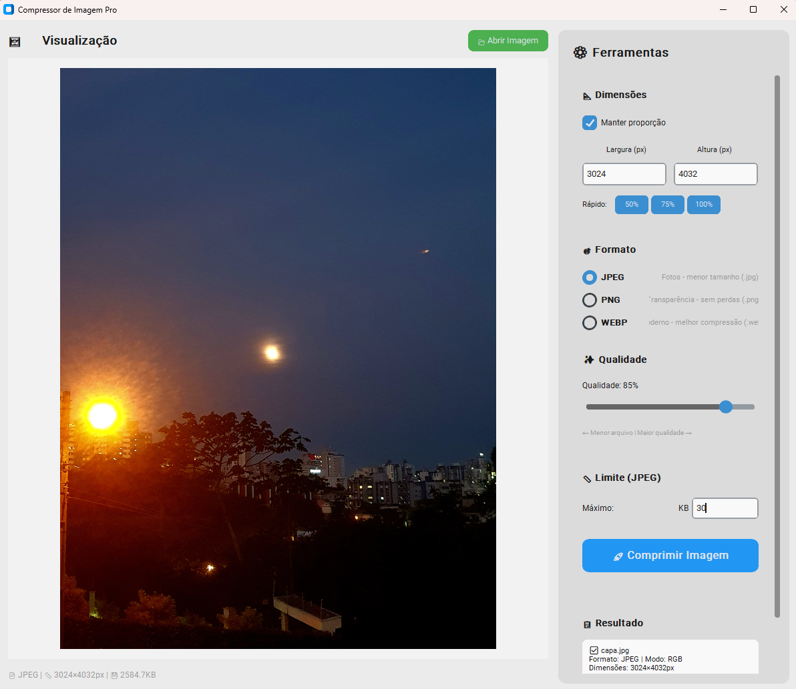
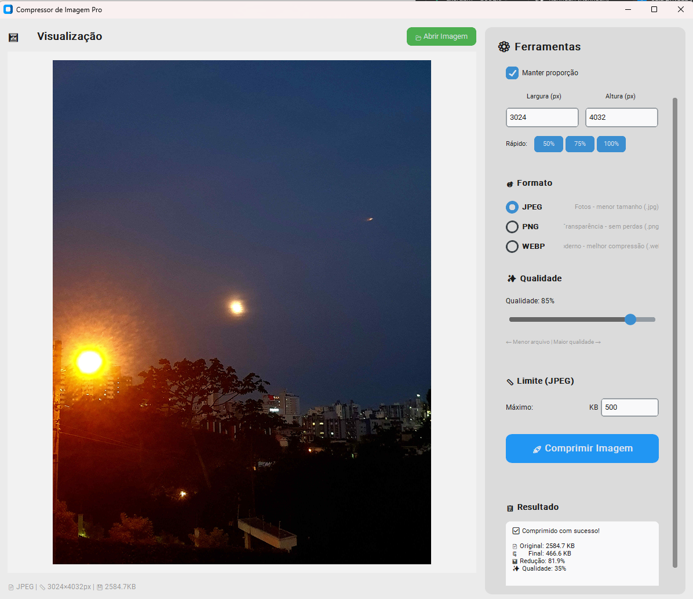

# Compress Image Pro

> Aplicação desktop para comprimir, redimensionar e converter imagens com controle visual sobre qualidade, dimensões e formato de saída.

O **Compress Image Pro** foi desenvolvido em Python para simplificar a otimização de imagens sem exigir o uso de ferramentas complexas. A aplicação oferece uma interface gráfica para selecionar arquivos, visualizar alterações e ajustar a compressão antes de salvar.

## 🎯 O problema que resolve

Imagens grandes ocupam espaço, deixam páginas mais pesadas e dificultam uploads ou compartilhamentos.

O projeto automatiza esse processo, permitindo reduzir dimensões e tamanho do arquivo mantendo controle sobre a qualidade final.

## ✨ Principais funcionalidades

- Interface gráfica moderna
- Pré-visualização da imagem
- Redimensionamento com preservação de proporção
- Compressão configurável
- Conversão entre formatos
- Suporte a JPEG, PNG e WEBP como saída
- Preservação de transparência quando aplicável
- Ajustes voltados à otimização de imagens
- Barra de progresso
- Processamento em thread separada para manter a interface responsiva
- Exibição do tamanho original, tamanho final e percentual de redução

## 📥 Formatos de entrada

Entre os formatos suportados estão:

- JPEG / JPG
- PNG
- BMP
- GIF
- TIFF
- WEBP
- ICO
- PPM
- PGM
- PCX
- TGA

## 📤 Formatos de saída

| Formato | Uso recomendado |
|---|---|
| JPEG | Fotografias e imagens sem transparência |
| PNG | Imagens com transparência e elementos gráficos |
| WEBP | Uso web e boa relação entre qualidade e tamanho |

## 📸 Screenshots

### Imagem carregada



### Resultado da compressão



## 🧠 Destaques técnicos

O projeto combina processamento de imagens e interface gráfica, com cuidados para que arquivos maiores não travem a aplicação.

Alguns pontos implementados:

- processamento com **Pillow**;
- interface com **CustomTkinter**;
- compressão executada em **thread separada**;
- callbacks para atualização segura da interface;
- preview antes do salvamento;
- tratamento de transparência;
- cálculo da redução obtida após o processamento.

## 🛠️ Tecnologias

- Python 3
- Pillow
- CustomTkinter
- threading
- Tkinter

## 📦 Instalação

Clone o projeto:

```bash
git clone https://github.com/Kennedh/Compress_Image.git
cd Compress_Image
```

Instale as dependências:

```bash
pip install -r requirements.txt
```

## ▶️ Como executar

```bash
python compress_image.py
```

## 🔄 Fluxo de uso

1. Selecione uma imagem.
2. Visualize o arquivo na interface.
3. Escolha formato, qualidade e dimensões desejadas.
4. Inicie a compressão.
5. Confira o tamanho original, o tamanho final e a redução obtida.
6. Salve o arquivo otimizado.

## 💡 O que este projeto demonstra

- Manipulação e conversão de arquivos
- Desenvolvimento de interfaces desktop
- Processamento de imagens
- Execução de tarefas em segundo plano
- Validação de parâmetros
- Feedback visual de progresso e resultado

## 🚀 Possíveis evoluções

- Processamento em lote
- Drag and drop
- Perfis prontos para web, e-mail e redes sociais
- Comparação lado a lado entre original e resultado
- Empacotamento como executável

---

Desenvolvido por [Kennedh](https://github.com/Kennedh).
